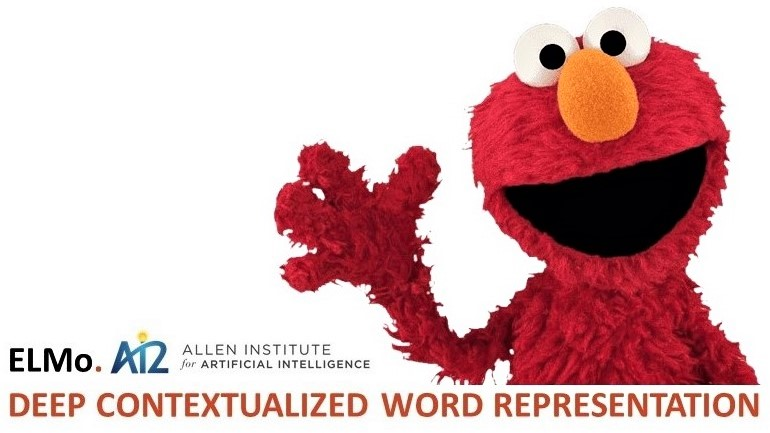

# ELMo-Modeling
State-of-the-Art Text Classification using Deep Contextual Word Representations

Text classification is one of the important and paradigmatic tasks in supervised machine learning with significant applications in the commercial world. “Deep Contextual Word Representations” was a paper that gained a lot of interest before it was officially published at NAACL this year. The high impact of this paper went on to award it with Outstanding Paper at NAACL, which cemented the fact that embeddings from language models should be the breakthroughs in NLP for years to come. Attempts have been made here to dissect the capability of “Deep Contextual Word Representations” and distill its essence to construct a multi-class text classification model.

## Team
* [Ausaf Ahmed](https://github.com/ausafaq)
* [Aakash Kanvinde](https://github.com/aakashkanvinde)
